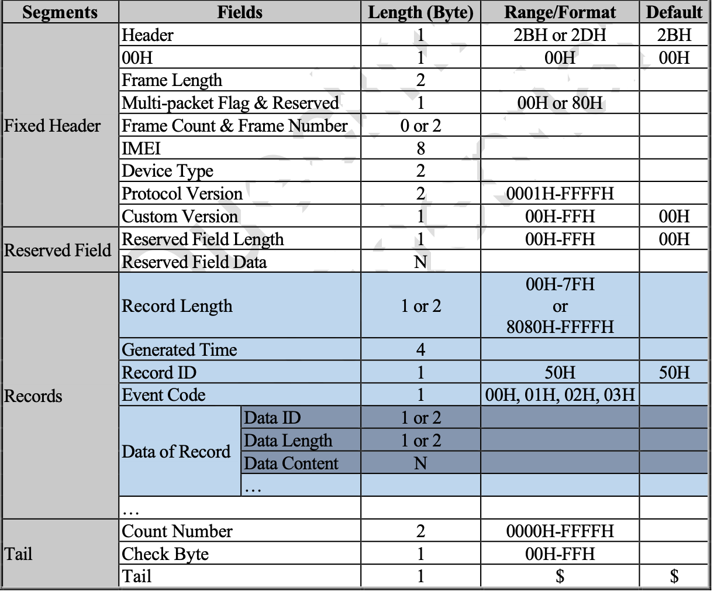

# Bindata parser

✨Bindata parser✨ is a binary data frame processing tool intended to demonstrate the frame parsing capability of a [Queclink-Driving Smarter IoT device](https://www.queclink.com/product/gv501lg/). The robust telematics firmware and reliable OBD data access engine of the IoT device supports reliable data gathering of VIN, odometer and also diagnostic trouble codes (DTC) for vehicle maintenance applications

## Features

- Read binary data from a log file recorded from the [Queclink-Driving Smarter IoT device](https://www.queclink.com/product/gv501lg/) for offline processing 
- Parse data as outlined in the frame format
- Output parse data on console

## Frame format

## Installation

Bindata parser requires [Microsoft Visual Studio](https://visualstudio.microsoft.com/vs/community/) community edition may suffice. 

Install the dependencies for a C# console application development.

#### Building for source

Use the ConsoleApp1.csproj file to import the project in the IDE and then build/debug your application.

> Note: Use the IDE to build the debug version in case you want to undertake interactive debugging.

## License

MIT

